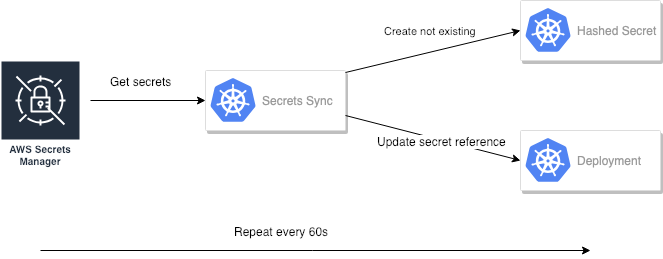

# AWS Secrets Manager K8s


### [View all Roadmaps](https://github.com/nholuongut/all-roadmaps) &nbsp;&middot;&nbsp; [Best Practices](https://github.com/nholuongut/all-roadmaps/blob/main/public/best-practices/) &nbsp;&middot;&nbsp; [Questions](https://www.linkedin.com/in/nholuong/)
<br/>

Sync [AWS Secrets Manager](https://github.com/nholuongut/aws-secrets-manager-k8s) secrets into a Kubernetes
cluster.

## Problem statement

While [AWS Secrets Manager](https://github.com/nholuongut/aws-secrets-manager-k8s) provides an API and various SDKs
to use it from within an application, it's either not possible or not wanted to modify any application to call AWS Secrets Manager directly.

The solution in this repository allows to sync secrets from AWS Secrets Manager into
[Kubernetes Secrets](https://kubernetes.io/docs/concepts/configuration/secret/) to make them accessible
via as [files or environment variables](https://kubernetes.io/docs/concepts/configuration/secret/#using-secrets)
for applications.

## Implementation

The CRD implements a continuous reconcile loop for every sync instance:

1. List all secrets the AWS role can see
1. Filter out not allowed prefixes and namespaces
1. Convert them to hashed Kubernetes Secrets
1. Create the hashed Kubernetes Secrets
1. Update references to all managed secrets in
   1. Deployments
   1. StatefulSets
   1. CronJobs
1. Sleep for one minute and restart



## Usage

Create an AWS Role with access to the AWS Secrets Manager secrets you want to sync.

The secret names should have the following format: `prefix/namespace/name`, with the prefix
being an arbitrary string (e.g. `production`, `staging`) and `namespace` reflecting the targeted
Kubernetes Namespace and `name` of the to be created Kubernetes Secret.

Before defining the actual sync config, deploy the manager and CRD definition using `make deploy` into your cluster.

After that setup the actual sync similar to:

```yaml
apiVersion: awssecretsmanager.nholuongut.net/v1alpha1
kind: Sync
metadata:
  labels:
    controller-tools.k8s.io: "1.0"
  name: sync-sample
spec:
  awsRoleARN: aws-role-to-be-used
  prefix: production/
  namespaces:
  - "default"
  - "monitoring"
```

## Development

This project is developed using [kubebuilder](http://book.kubebuilder.io/) and follows the documented kubebuilder development workflow.

# 🚀 I'm are always open to your feedback.  Please contact as bellow information:
### [Contact ]
* [Name: Nho Luong]
* [Skype](luongutnho_skype)
* [Github](https://github.com/nholuongut/)
* [Linkedin](https://www.linkedin.com/in/nholuong/)
* [Email Address](luongutnho@hotmail.com)
* [PayPal.me](https://www.paypal.com/paypalme/nholuongut)


[](https://ko-fi.com/nholuong)

# License
* Nho Luong (c). All Rights Reserved.🌟
